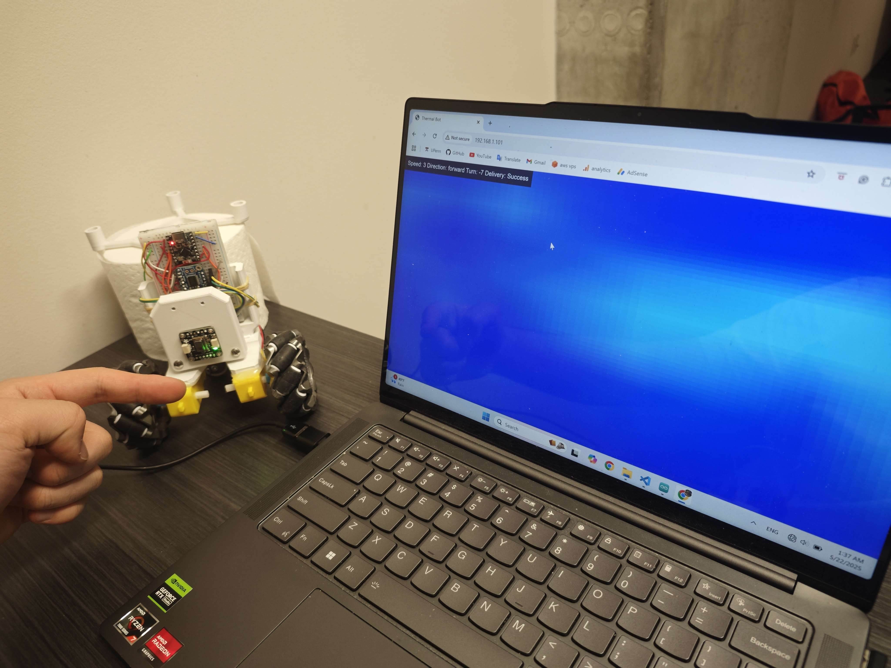

# Toast-E Thermal Bot
Toast-E is an ESP32-based thermal robot that combines wireless joystick control with live thermal imaging streamed to a web browser. 
> It uses ESP-NOW for low-latency communication between the controller and the main board.

---

## What can it do

  
*Figure 1: Live thermal view rendered in a web browser.*

  
*Figure 2: Toast-E maneuvering under joystick control.*

---

## 🌟 Enhanced Display

Web code uses bilinear interpolation to upscale the thermal imaging resolution from 8×8 to 64×64. This provides a smoother and more detailed visualization of the thermal data, making it easier to interpret heat patterns.

  
*Figure 3: Enhanced thermal display with upscaled resolution.*

---

## 🔧 Features

### **Wireless Control**
- **ESP-NOW Communication**: Peer-to-peer link between the controller and the main board.
- **Joystick Input**: Control speed, direction, and turn rate.
- **Emergency Stop**: Dedicated button for immediate halt.

### **Thermal Sensing & Visualization**
- **AMG8833 Sensor**: 8×8 thermal array for heat detection.
- **Enhanced Display**: Upscaled 64×64 thermal visualization using bilinear interpolation.
- **Live Streaming**: Thermal data streamed at up to 10 Hz.
- **Web-Based UI**: View the heatmap directly in a browser.

### **Modular Firmware**
- **Controller**: Handles joystick input, web server, and ESP-NOW communication (`controller/controller.ino`).
- **Main Board**: Manages motor control, thermal sensing, and ESP-NOW communication (`main/main.ino`).

---

## ⚙️ Hardware Requirements

- **ESP32 Development Boards** (×2): One for the controller, one for the main board.
- **Adafruit AMG8833 Thermal Sensor**: For thermal imaging.
- **TB6612FNG Motor Driver**: Controls DC motors.
- **Analog Joystick**: For directional input.
- **Momentary Push Button**: For emergency stop.

---

## Getting Started

### 1. **Flash the Controller**
- Open [`controller/controller.ino`](controller/controller.ino) in Arduino IDE.
- Install required libraries: `WiFi`, `esp_now`, `WebServer`.
- Configure joystick and emergency stop pins.
- Upload the code to the ESP32.

### 2. **Flash the Main Board**
- Open [`main/main.ino`](main/main.ino) in Arduino IDE.
- Install required libraries: `Adafruit_AMG88xx`, `WiFi`, `esp_now`.
- Configure motor driver and I2C pins.
- Upload the code to the second ESP32.

### 3. **Power & Pair**
- Power both boards via USB or battery.
- Check the serial monitor for the controller's AP SSID (`ThermalView`) and IP address.
- Verify ESP-NOW peer pairing in the serial output.

### 4. **Drive & View**
- Connect your PC or phone to the Wi-Fi SSID `ThermalView`.
- Open a browser and navigate to `http://192.168.1.101/`.
- Use the joystick to control the robot while viewing the live thermal heatmap.

---

## 🛠️ Troubleshooting

### Common Issues
1. **ESP-NOW Initialization Fails**  
   - Ensure both ESP32 boards are powered and within range.
   - Verify MAC addresses in the code match the hardware.

2. **Thermal Sensor Not Detected**  
   - Check I2C connections (SDA, SCL).
   - Ensure the AMG8833 sensor is properly powered.

3. **Web Interface Not Loading**  
   - Confirm your device is connected to the `ThermalView` Wi-Fi network.
   - Verify the IP address in the browser matches the controller's serial output.

---

# Enjoy!